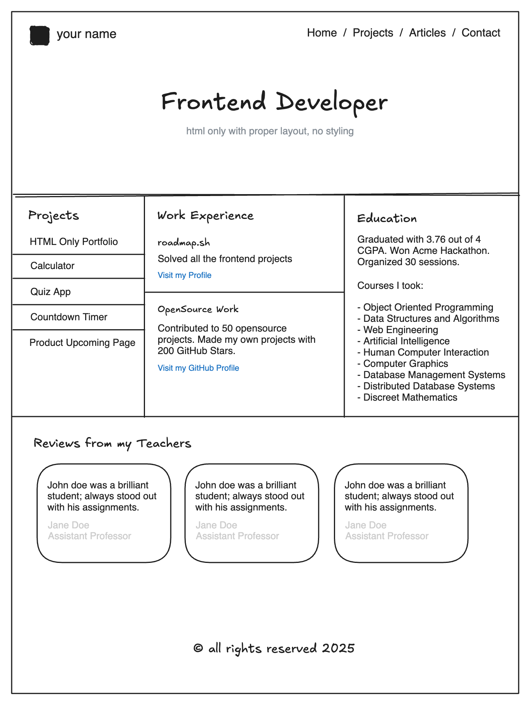

# Basic-HTML-Website

El objetivo de este proyecto es enseñarte a estructurar un sitio web usando HTML, es decir, las diferentes secciones como encabezado, pie de página, navegación, contenido principal, barras laterales, etc. **No diseñes el sitio web**, solo concéntrate en la estructura. El estilo se realizará en proyectos separados.

## Requisitos del proyecto

Crea un sitio web simple, solo con HTML, que incluya varias páginas. El sitio web debe tener las siguientes páginas:

- **Página principal**
- **Proyectos**
- **Artículos**
- **Contacto**

El sitio web debe tener una barra de navegación presente en todas las páginas y enlazar a todas ellas.

## Objetivos

- Aprender a crear varias páginas en un sitio web.
- Estructurar un sitio web usando HTML de forma semántica.
- Estructurarlo de forma que puedas agregar estilos fácilmente más adelante.
- Agregar metaetiquetas SEO al sitio web.

Puedes utilizar el siguiente ejemplo de maqueta para crear la estructura del sitio web (recuerda, no es necesario diseñar el sitio web, solo concéntrate en la estructura):

## Asegúrate de incluir

- Estructura HTML semánticamente correcta.
- Varias páginas con una barra de navegación.
- Metaetiquetas SEO en el `<head>` de cada página.
- La página de contacto debe incluir un formulario con campos como nombre, correo electrónico, mensaje, etc.

---

Después de completar este proyecto, comprenderás cómo estructurar un sitio web usando HTML, metaetiquetas SEO básicas, etiquetas HTML, formularios, etc. Luego podrás pasar al siguiente proyecto, donde aprenderás a diseñar este sitio web con CSS.